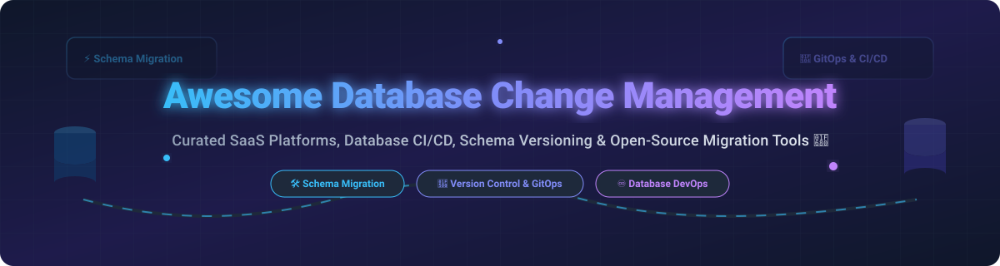

# 🗄️ Awesome Database Change Management 🚀

  

  
  
  
  
  

---

## 📌 Executive Summary & Key Highlights

A **curated directory of database change management tools, database CI/CD platforms, schema migration frameworks, and version control solutions**. These production-grade tools allow developers, DBAs, and platform engineers to version-control database schemas as code, automate migrations across staging and production environments, perform automated SQL reviews, and enforce GitOps workflows.

---

## 📊 Market Overview & Industry Dynamics

> 💡 **Market Size & Fragmentation Analysis**: The global **Database Change Management & Database DevOps** sector operates within the broader **$149B+ Database Management System (DBMS)** and **$3.8B Change Management Software** ecosystem. The sector is **highly fragmented** rather than "winner-take-all", characterized by a mix of enterprise SaaS suites (Redgate, Quest, Devart), developer-first migration engines (Liquibase, Flyway, Atlas), and web-based GitOps portals (Bytebase). Organizations select solutions based on workflow preference (SQL-first vs. changelog vs. declarative HCL) and governance capabilities.

---

## 📑 Table of Contents

- [☁️ SaaS / Hosted Platforms](#-saas--hosted-platforms)
- [🔓 Open-Source GitHub Projects](#-open-source-github-projects)
  - [🚀 Top Open-Source Migration Tools & Platforms](#-top-open-source-migration-tools--platforms)
- [🤝 How to Contribute](#-how-to-contribute)
- [⚠️ Disclaimer](#-disclaimer)
- [📈 Star History](#-star-history)
- [💖 Support & Community](#-support--community)

---

## ☁️ SaaS / Hosted Platforms

| Product Name | Description | Company Size / Scale | Starting Pricing | Free Tier / Trial Limits |
| :--- | :--- | :--- | :--- | :--- |
| **[Redgate SQL Change Automation](https://www.red-gate.com/products/sql-development/sql-change-automation/)** | Enterprise SQL Server database DevOps & migration platform integrated with CI/CD pipelines. | **$100M+ ARR** (~550 employees, backed by Bregal Sagemount) | $995/user/year (via Redgate SQL Toolbelt) | 14-day to 28-day fully functional free trial |
| **[Liquibase Secure](https://www.liquibase.com/)** | Commercial edition of Liquibase adding enterprise governance, policy enforcement, rollbacks, and compliance auditing (SOX, DORA). | **$10M–$20M Est. ARR** (funded enterprise software company) | $5,000/year (Starter tier for up to 5 apps) | 30-day free trial of Liquibase Secure features |
| **[DbForge Source Control](https://www.devart.com/dbforge/)** | Database version control tool by Devart supporting Git, SVN, and TFS across multiple database engines. | **$27M ARR** (~245 employees, Devart) | $190/user/year (Subscription) or $370 (Perpetual) | 30-day fully functional free trial |
| **[ApexSQL DevOps](https://www.apexsql.com/)** | Database DevOps & schema deployment toolkit for Microsoft SQL Server (part of Quest Software). | **Subsidiary of Quest Software** ($1B+ parent revenue) | $1,495/developer seat (DevOps Toolkit Suite) | 14-day fully functional free trial |
| **[Bytebase Cloud](https://bytebase.com/)** | Web-based database CI/CD workspace providing SQL linting, GitOps workflows, dynamic data masking, and RBAC. | **Early-stage venture** ($3M Seed funded) | $20/user/month (Pro plan) | Free forever Community plan (Up to 20 users & 10 DB instances) |

---

## 🔓 Open-Source GitHub Projects

### 🚀 Top Open-Source Migration Tools & Platforms

Open-source tools dominate database change management. The table below lists top open-source projects sorted by GitHub stars:

| Repository Name | Description | License | Ecosystem / Stack | GitHub Stars |
| :--- | :--- | :--- | :--- | :--- |
| **[Prisma Migrate](https://github.com/prisma/prisma)** | Declarative & versioned schema migration engine integrated with Prisma ORM. | Apache-2.0 | Node.js / TypeScript |  |
| **[golang-migrate](https://github.com/golang-migrate/migrate)** | CLI and Go library for CLI-driven database migrations supporting 20+ drivers. | MIT | Go |  |
| **[sqlc](https://github.com/sqlc-dev/sqlc)** | Compiles SQL queries into type-safe Go/Python/Kotlin code with built-in migration integration. | MIT | Go / Polyglot |  |
| **[Bytebase](https://github.com/bytebase/bytebase)** | Web-based Database DevOps workspace & CI/CD platform (CNCF Landscape). | Apache-2.0 | Go / Vue / TypeScript |  |
| **[goose](https://github.com/pressly/goose)** | Database migration tool supporting SQL scripts and Go functions for custom migration logic. | MIT | Go |  |
| **[Flyway](https://github.com/flyway/flyway)** | Developer-friendly, SQL-first database migration framework supporting 50+ databases. | Apache-2.0 | Java |  |
| **[Atlas](https://github.com/ariga/atlas)** | Terraform-like declarative schema management engine with 50+ safety lint analyzers. | Apache-2.0 | Go |  |
| **[Liquibase](https://github.com/liquibase/liquibase)** | Enterprise-grade changelog-driven migration tool supporting 60+ databases and rollbacks. | Apache-2.0 | Java |  |
| **[Sqitch](https://github.com/sqitchers/sqitch)** | VCS-centric, target-agnostic database change management application without auto-generated IDs. | MIT | Perl / SQL |  |
| **[DbUp](https://github.com/DbUp/DbUp)** | Lightweight .NET library for tracking and applying SQL Server schema updates. | MIT | C# / .NET |  |
| **[Skeema](https://github.com/skeema/skeema)** | Declarative pure-SQL schema management tool for MySQL & MariaDB. | Apache-2.0 | Go |  |
| **[SchemaHero](https://github.com/schemahero/schemahero)** | Kubernetes operator turning database schemas into declarative custom resources (CRDs). | Apache-2.0 | Go / Kubernetes |  |

---

## 🤝 How to Contribute

Contributions are welcome! Please follow these guidelines:

1. 🍴 Fork this repository.
2. 📝 Add or edit entries in `README.md` using standard markdown formatting.
3. 🔍 Ensure description includes product name, website link, category, license, and primary capabilities.
4. 🚀 Open a Pull Request with a clear summary of changes.

---

## ⚠️ Disclaimer

- This list is **community-curated** for informational and educational purposes.
- Always perform safety checks, backup procedures, and compliance reviews before introducing database change management automation into mission-critical environments.

---

## 📈 Star History

---

## 💖 Support & Community

If you find this repository helpful, please consider supporting the project!

- ⭐ **Star** this repository on GitHub to show your appreciation.
- 🔄 **Fork** and share it with your DevOps and Database Engineering colleagues.
- ☕ **Sponsor**: Buy me a coffee via [GitHub Sponsors](https://github.com/sponsors/ishandutta2007).

---
*Maintained with ❤️ for database engineers, DBAs, DataOps teams, and platform engineers worldwide.*
